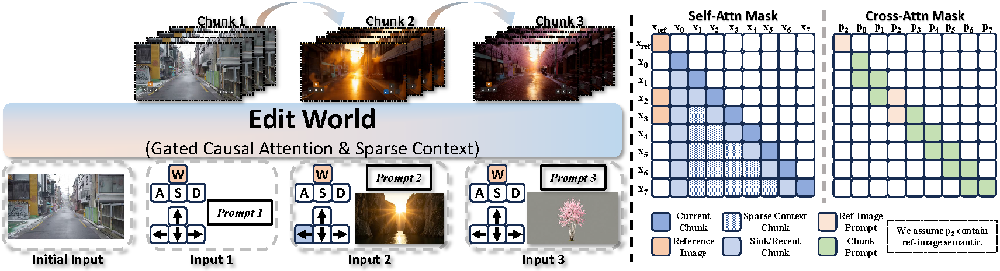

<div align="center">

# EditWorld: Precise Editing and Flexible Referencing for Interactable Worlds

**Xinyao Liao<sup>1,2</sup>, Xianfang Zeng<sup>2*</sup>, Zhu Liang<sup>2</sup>, Zhoujie Fu<sup>1</sup>,  
Qianxun Xu<sup>2</sup>, Jiachi Liu<sup>1</sup>, Gang Yu<sup>2†</sup>, Guosheng Lin<sup>1†</sup>**

<sup>1</sup>Nanyang Technological University &nbsp;&nbsp; <sup>2</sup>StepFun  
<sup>*</sup>Project Lead &nbsp;&nbsp; <sup>†</sup>Corresponding Authors

[](docs/Precise_Editing_and_Flexible_Referencing_for_Interactable_Worlds__arXiv_.pdf)
[](https://www.youtube.com/watch?v=D4W1Eaw36Vs)
[](https://huggingface.co/leoisufa/EditWorld)

</div>

<p align="center">
  <a href="https://www.youtube.com/watch?v=D4W1Eaw36Vs">
    
  </a>
  <br>
  <em><a href="https://www.youtube.com/watch?v=D4W1Eaw36Vs">Click to watch the demo video.</a></em>
</p>

## Overview

<p align="center">
  
</p>

EditWorld is a video world model for precise editing and flexible referencing in interactable
worlds. It extends world modeling from exploration to precise modification through streaming
editing instructions and reference images during autoregressive generation.

## Open-source Plan

- ✅ Multi-step autoregressive inference
- [ ] Few-step autoregressive model
- [ ] WBench-Editing

## Installation

### Create the environment

```bash
conda create -n editworld python=3.11 -y
conda activate editworld

pip install torch==2.10.0 torchvision==0.25.0 torchaudio==2.10.0 --index-url https://download.pytorch.org/whl/cu128
pip install -r requirements.txt
```

#### Install FlashAttention

```bash
# Choose either FA2 or FA3 according to your GPU and environment.

# Option 1: Install FA2 from source
pip install ninja
git clone https://github.com/Dao-AILab/flash-attention.git
cd flash-attention
MAX_JOBS=4 python -m pip install . --no-build-isolation

# Option 2: Install FA3 from source
pip install ninja
git clone https://github.com/Dao-AILab/flash-attention.git
cd flash-attention/hopper
MAX_JOBS=4 python -m pip install . --no-build-isolation
```

## Model Weights

Model weights: [leoisufa/EditWorld](https://huggingface.co/leoisufa/EditWorld).
Place the shared weights under `ckpt/` and the pretrained DiT experts under `ckpt/pretrain/`:

```text
ckpt/
├── models_t5_umt5-xxl-enc-bf16.pth
├── Wan2.1_VAE.pth
├── google/umt5-xxl/
└── pretrain/
    ├── low_noise_model/
    │   ├── config.json
    │   └── diffusion_pytorch_model.safetensors
    └── high_noise_model/
        ├── config.json
        └── diffusion_pytorch_model.safetensors
```

## Prepare Inputs

Pass a UTF-8 manifest to `--txt_file`. Each line pairs a first-frame image with its case JSON:

```text
img/input.png@json/case.json
```

Paths in the manifest are relative to the manifest file.
See `assets/batch_infer_samples.txt` and its paired JSON files for complete examples,
including camera poses and intrinsics.

The JSON supplies a scene description (`caption.SceneDescription`), editing prompts
(`editmeta.edit_instruction_N`), camera data, and an `editing_annotation` entry for **every**
generated chunk. The excerpt below shows the editing fields:

```json
{
  "caption": {
    "SceneDescription": "A quiet street lined with buildings."
  },
  "editmeta": {
    "edit_instruction_1": "<first edit instruction>",
    "edit_instruction_2": "<second edit instruction>"
  },
  "editing_annotation": {
    "0": {"state": "navigation"},
    "1": {"state": "editing_1", "reference_image": "../ref/first.png"},
    "2": {"state": "editing_1", "reference_image": "../ref/first.png"},
    "3": {"state": "editing_2"}
  }
}
```

`navigation` has no editing prompt; `editing_N` selects `edit_instruction_N`. A chunk uses a
reference image only when its own annotation includes `reference_image`; that path is relative
to the JSON file.

## Run Inference

### Multi-step inference with CFG

```bash
bash inference_pertrain.sh
```

The script runs on eight GPUs with sequence parallelism (`--sp_size 8`) and multi-step CFG
(`--sampling_steps 70`, `--guide_scale 5.0`). Its arguments can be overridden on the command line,
for example `bash inference_pertrain.sh --txt_file /path/to/cases.txt --save_dir /path/to/outputs/`.
Videos are named by manifest order: `case 1.mp4`, `case 2.mp4`, and so on.
Run `python inference.py --help` for the complete option list.

## Citation

If you find EditWorld useful, please cite our work:

```bibtex
@misc{liao2026precise,
  title   = {Precise Editing and Flexible Referencing for Interactable Worlds},
  author  = {Liao, Xinyao and Zeng, Xianfang and Liang, Zhu and Fu, Zhoujie and
             Xu, Qianxun and Liu, Jiachi and Yu, Gang and Lin, Guosheng},
  year    = {2026},
  note    = {Preprint},
  url     = {https://github.com/leoisufa/EditWorld}
}
```

## Acknowledgements

EditWorld builds upon [LingBot-World](https://github.com/Robbyant/lingbot-world) and
[WBench](https://github.com/meituan-longcat/WBench). We thank the authors for making their work
open source.
